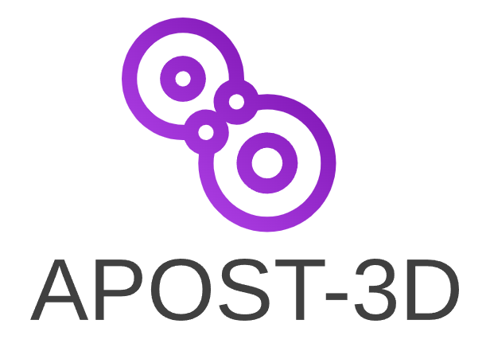

<p align="center"></p>

<h3 align="center">A molecular and orbital/density visualizer for APOST-3D</h3>

<p align="center">APOST3Dview is being built as the visual companion to <a href="https://github.com/mgimferrer/APOST3D">APOST-3D</a>: reading its <code>.apost</code> output directly and presenting the chemical bonding indicators it computes (fragment analysis, effective oxidation states, IQA energy decomposition, QTAIM, and more) in a clear, user-friendly way. That piece is still in development. Today, it already renders real-time, GPU-rendered geometry, <code>.cube</code> isosurfaces, and orbitals generated directly from a <code>.fchk</code> or <code>.molden</code> file, no external <code>cubegen</code>/Multiwfn step required.</p>

<!-- Screenshots section: coming soon, once a representative set of images is chosen. -->

## Shortcuts

* [What it does](#what-it-does)
* [Installation](#installation)
* [How to use](#how-to-use)
* [Known limitations](#known-limitations)
* [Connection to APOST-3D](#connection-to-apost-3d)
* [Citations](#citations)
* [License](#license)
* [Bug reports and feature requests](#bug-reports-and-feature-requests)

## What it does

[APOST-3D](https://github.com/mgimferrer/APOST3D) computes chemical bonding concepts (fragment analysis, effective oxidation states, IQA energy decomposition, QTAIM, and more) from a wave function, as plain text output. APOST3Dview's eventual purpose is to read that `.apost` output directly and display its most relevant indicators on top of the molecule, in a clear, user-friendly way, so results don't have to be read out of a text file by hand. That part isn't built yet (see [Known limitations](#known-limitations)).

What's already here, usable today:

- **Geometry viewing**: `.fchk` and `.xyz`, raymarched sphere/cylinder impostors (not polygon meshes) with CPK coloring, true 3D depth-tested atom labels, and one-click PNG export sized for a journal figure (DPI and physical size embedded in the file).
- **`.cube` isosurfaces**: standard Gaussian cube files, rendered as a smoothed (Surface Nets + Taubin) mesh, with tunable isovalue, refinement, and color per lobe.
- **Orbitals generated directly from a wave function**, no `.cube` file needed. A from-scratch Rust GTO evaluator (s/p/d/f/g shells, restricted and unrestricted, ECPs handled transparently) reads a `.fchk` or a PySCF-written `.molden` file and evaluates any molecular orbital on a grid on the spot. Validated against independently generated reference cubes down to numerical noise (RMS around 10⁻⁶ to 10⁻⁷ of peak magnitude) across every shell type, and both restricted and open-shell cases.
- **Physically-based rendering**: Cook-Torrance/GGX lighting, screen-space ambient occlusion, depth of field, and linear-light tone mapping, with Default and Publication (figure-ready, orientation-independent lighting) style presets, plus your own saved Custom looks.
- **Analysis**: distance, angle, and dihedral measurements from a normal atom selection, with draggable, fully customizable labels.

## Installation

APOST3Dview is developed and tested on macOS. Windows and Linux builds should work through the same Rust/wgpu toolchain, but haven't been verified end-to-end yet. Feedback from anyone who tries either is very welcome.

### macOS

1. Install [Rust](https://rustup.rs/) via `rustup`.
2. Install the Xcode Command Line Tools: `xcode-select --install`.
3. Build (see [Building from source](#building-from-source) below).

### Windows

The easiest path, for almost everyone: download and run [`rustup-init.exe`](https://rustup.rs/) and pick the default option (1). If Visual Studio's C++ Build Tools aren't already on your machine, rustup detects that and downloads and installs them for you automatically as part of the same install (about 1.5 GB, 5 to 15 minutes, no separate trip to the Visual Studio site needed). Then build (see [Building from source](#building-from-source) below).

If you'd rather not have Visual Studio installed at all, there's a lighter alternative: [WinLibs](https://winlibs.com/) is a standalone GCC and MinGW-w64 build for Windows that needs no MSYS2 or Visual Studio.

1. Download a WinLibs release, extract it somewhere like `C:\mingw64`, and add its `bin` folder to your `PATH`.
2. Run `rustup-init.exe`. At the "Rust Visual C++ prerequisites" step, choose option 3 ("Don't install the Visual C++ prerequisites"), then option 2 ("Customize installation") and set the default host triple to `x86_64-pc-windows-gnu`.
3. Build as usual.

This GNU-toolchain path is less commonly used than the MSVC one for Rust GUI apps, so treat it as the "don't want Visual Studio on my machine" option rather than the most battle-tested one. Either way, wgpu targets DirectX12/Vulkan on Windows.

**What about WSL?** Windows Subsystem for Linux can run GPU-accelerated Linux GUI apps through WSLg, so building and running APOST3Dview inside a WSL Ubuntu install (see [Linux](#linux) below, once inside it) is technically possible. In practice it isn't simpler for most people: it's a whole Linux environment to set up, and Vulkan passthrough through WSLg is newer and less proven than either native option above. Worth trying only if you're already comfortable living in a Linux shell and would rather avoid Visual Studio and MinGW alike.

A prebuilt Windows executable (no Rust toolchain needed at all) isn't available yet, but is the likely eventual path for non-developer users; this section will be updated once one exists.

### Linux

1. Install [Rust](https://rustup.rs/) via `rustup`.
2. Install the system packages `eframe` (this app's UI framework) needs to build its window and native file dialogs, along with a C compiler. On Ubuntu/Debian:
   ```bash
   sudo apt-get install -y build-essential libclang-dev libgtk-3-dev libxcb-render0-dev libxcb-shape0-dev libxcb-xfixes0-dev libxkbcommon-dev libssl-dev
   ```
   On Fedora:
   ```bash
   sudo dnf install gcc clang clang-devel clang-tools-extra libxkbcommon-devel pkg-config openssl-devel libxcb-devel gtk3-devel atk fontconfig-devel
   ```
   (Straight from [egui's own README](https://github.com/emilk/egui), the UI library APOST3Dview is built on.) If you're on a Wayland-only compositor without XWayland, you may additionally need `libwayland-dev` (Ubuntu/Debian) or the equivalent for native Wayland windowing support.
3. Make sure a Vulkan driver is actually installed for your GPU, separate from the build itself: `mesa-vulkan-drivers` for open-source Mesa drivers, or your GPU vendor's proprietary driver package if you use one. Without this, the app can build fine but fail to find a GPU at runtime.
4. Build (see [Building from source](#building-from-source) below).

### Building from source

```bash
git clone https://github.com/mgimferrer/APOST3Dview.git
cd APOST3Dview
cargo build --release -p apost3dview
```

The binary is then at `target/release/apost3dview` (`.exe` on Windows). For active development, `cargo run -p apost3dview` builds and launches in one step.

**Troubleshooting**: if `cargo`/`rustc` aren't found right after installing Rust, open a new terminal window. `rustup` adds `~/.cargo/bin` to `PATH` in your shell's startup file, which an already-open terminal won't have picked up yet.

## How to use

1. Launch the app and open the **Structures** panel (top toolbar).
2. Open a `.fchk`, `.molden`, `.xyz`, or `.cube` file.
3. For a `.fchk` or `.molden` file, the **Visualization** panel's "Generate orbitals" section lists every molecular orbital (HOMO/LUMO tagged, with energy and occupation). Tick the ones you want and click Generate. Each becomes its own isosurface, using the same controls as a `.cube` file (isovalue, refinement, per-lobe color, "Keep surface" to compose several orbitals in one image).
4. The **Style** panel controls lighting/material (or pick Default or Publication), atom/bond scale, and ambient occlusion/depth of field. Once you've tuned something you like, save it as a named Custom preset; it's written as a plain TOML file under `presets/` at the root of this repository (not tracked by git), so it's easy to find, back up, or hand to someone else. Custom presets you've saved appear as their own buttons alongside Default and Publication.
5. The **Analysis** panel builds distance/angle/dihedral measurements from whatever atoms are currently selected (2, 3, or 4 of them), no separate mode to switch into first.
6. The **Render** panel exports the current view as a PNG at a given DPI and physical figure size, or a custom resolution.

`TESTS-VISUALIZER/` in this repository has real committed `.fchk`/`.cube`/`.molden` test files (H2O and BiCl3 at several basis sets, an open-shell triplet, and a real APOST-3D bismuth complex), good for opening something right away.

## Known limitations

- `.molden` support currently targets PySCF's own writer specifically. Other programs' `.molden` output (ORCA in particular is known to deviate from the format for f/g functions) isn't tested yet.
- Basis functions above g (h, i, and so on) aren't supported. This fails with an explicit error rather than a silently wrong orbital.
- Cartesian g shells aren't implemented (pure/spherical g is). In practice, every basis set that reaches g is spherical by convention, so this hasn't been a real limitation so far.
- `.apost` (APOST-3D's own output format) isn't read yet. That's the next major piece of work, to visualize fragment/EOS/IQA/QTAIM descriptors directly on the geometry.
- Windows builds aren't verified end-to-end yet (see [Installation](#installation)).

## Connection to APOST-3D

APOST3Dview is a sister project to [APOST-3D](https://github.com/mgimferrer/APOST3D) (see its own README for the full scope of what it computes), but a fully independent codebase and language stack: Rust/wgpu, no Fortran, no shared code. It's built specifically to read the files APOST-3D works with, `.fchk` today, and soon `.apost` directly, rather than being a general-purpose molecular viewer that happens to also open them.

If you use APOST-3D itself, or the chemical bonding methods it implements, see APOST-3D's own README for the specific paper to cite for each method.

## Citations

APOST3Dview doesn't have its own dedicated publication yet. Until it does, if you use it in a paper, please cite the APOST-3D paper below:

* P. Salvador, E. Ramos-Cordoba, M. Montilla, L. Pujal and M. Gimferrer, *APOST-3D: Chemical concepts from wave function analysis*, **J. Chem. Phys.**, **2024**, 160, 172502
  DOI: [10.1063/5.0206187](https://doi.org/10.1063/5.0206187)

A `CITATION.cff` file is included in this repository, so GitHub's "Cite this repository" button stays up to date automatically.

## License

APOST3Dview is licensed under the [GNU General Public License v3.0](LICENSE).

Copyright © 2026 Martí Gimferrer.

## Bug reports and feature requests

Please open an [issue](https://github.com/mgimferrer/APOST3Dview/issues), or email [mgimferrer18@gmail.com](mailto:mgimferrer18@gmail.com).

## Author

**Martí Gimferrer**, University of Göttingen
[mgimferrer18@gmail.com](mailto:mgimferrer18@gmail.com)
